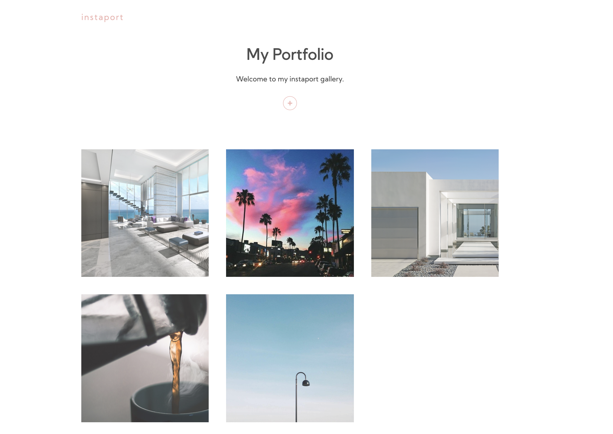

# instaport
Minimalist app for photography sharing.

## Screenshots

## Tech stack
React, Hooks, Firebase.

### Make your own
Clone repository.
Create your firebase database and storage.
Update the firebase code in config.js with your particular script.
